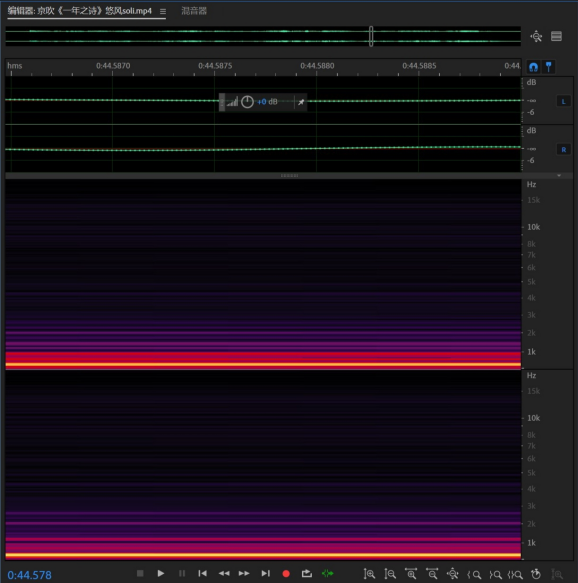

# 频谱分析

图一：1号演奏者 黑江真由

图二：2号演奏者 黄前久美子

&emsp;&emsp;首先来分析两位音频频谱。选取两位演奏员演奏同一位置的频谱，图二（久美子）的频谱比图一（黑江）的线条更细，数量更多，颜色更鲜艳。说明图二保真度更高，但是因为线条更细，代表乐器的音色没有完全发挥出来。该有的泛音不够强。相较于图一来说，图二音频的音色比较模糊。

&emsp;&emsp;图一的音频虽然线条更粗壮，共鸣腔能被完全激励出来，但它线条不够多，说明它被后期修过，音频不保真。

&emsp;&emsp;我的推测是图一做了破坏性的后期修正，极有可能是为了抹去一些录音时带进去的杂质。从演奏技法来看，确实是图一好，但是被录音毁了。

# 为什么普遍觉得久美子的更好听

&emsp;&emsp;首先我对比了久美子和黑江两段演奏音频的主频比：
* 黑江演奏时的主频比为 -31: -40
* 久美子演奏时的主频比为 -30: -38

&emsp;&emsp;得出的结果是**久美子和丽奈的配合更好**。

&emsp;&emsp;首先是黑江演奏时的收音不行，小号与上低音号的力度比例失衡，小号过于突出，而上低音号稍显不足，人工提升了上低音号的音量，但是带来了杂质，出现了破坏性的修改。为了压制这些杂质，用eq降低了部分频段的音量，结果泛音总数就减少了，导致听起来软软的没有力气。所以大部分人都觉得久美子吹的比较好听。

# 从音色上分析

&emsp;&emsp;真由的演奏气息稳定，节奏准确，音色统一，可以和高的小号声音完美的融合在一起，比喻起来就是如咖啡牛奶一般的协调，我觉得**这是专业的评委老师会喜欢的类型**，真由在技术上面的水平是肯定的。

&emsp;&emsp;久美子的演奏声音大胆悠长，在音色的统一性上虽然不如真由，但是**久部长的音乐里面充满了感情**，会让人听起来就感受出演奏者的热情，这一点会让人听的非常舒服，可以弥补久技术上面的不足，会随着高的小号配合自己的音色，让小号本身变的更加完美。

# 一年之诗第三乐章soli需要的是什么？

&emsp;&emsp;京吹第3季共13话，在前12话我们还没有听到过一次完整的《一年之诗》（《一年の詩~吹奏楽のための》）演奏，因此以下讨论仅基于作者假设。

&emsp;&emsp;如果第三乐章soli段需要的是小号和上低音号的**整体能力**，那么**久美子的演奏是明显优于黑江**。因为表演的核心在于人与人的配合，黑江和高坂配合不好，不配吹soli。

&emsp;&emsp;如果只评价单一乐器的表现能力，那黑江和久美子的评分不相上下。**黑江不擅长力度协调，久美子基本功不足**，都需要下去单练。

# 结论

&emsp;&emsp;在演奏技巧上，黑江确实比久美子更胜一筹。但是黑江的演奏由于后期破坏性的修改导致听起来缺乏力气。而久美子和丽奈配合的更好，而且充满感情能让观众感受到它的热情。因此，**她们各有优点，投票五五开也很合理。**
