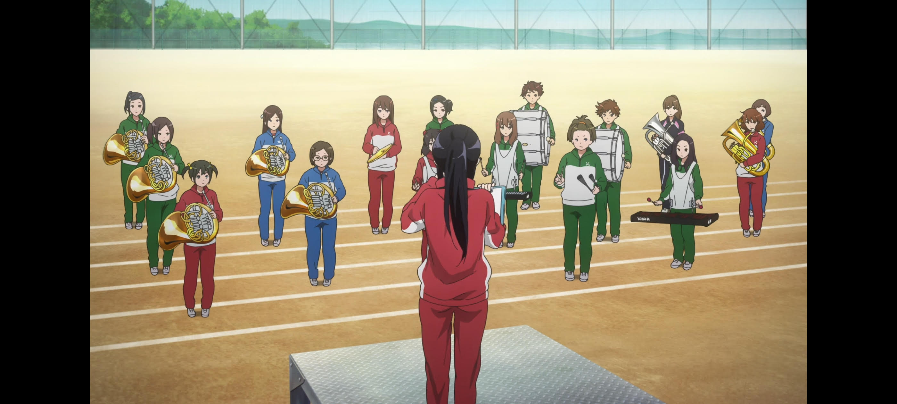
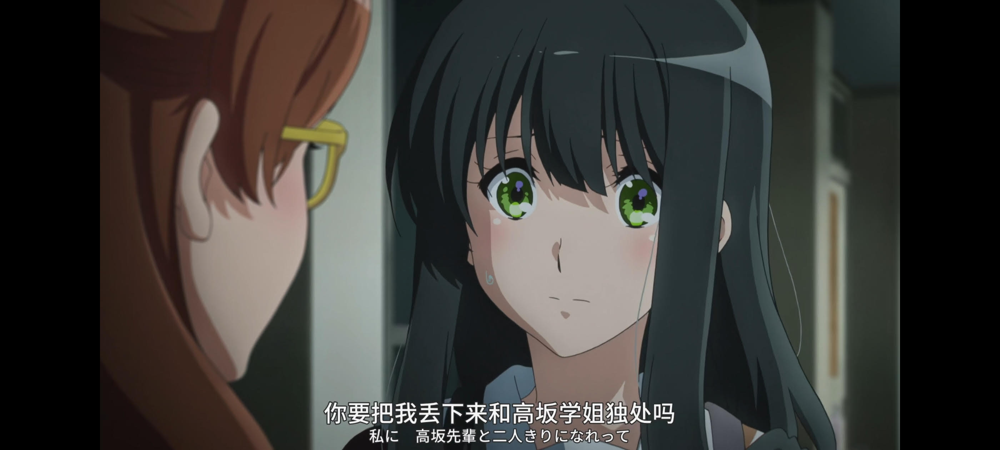
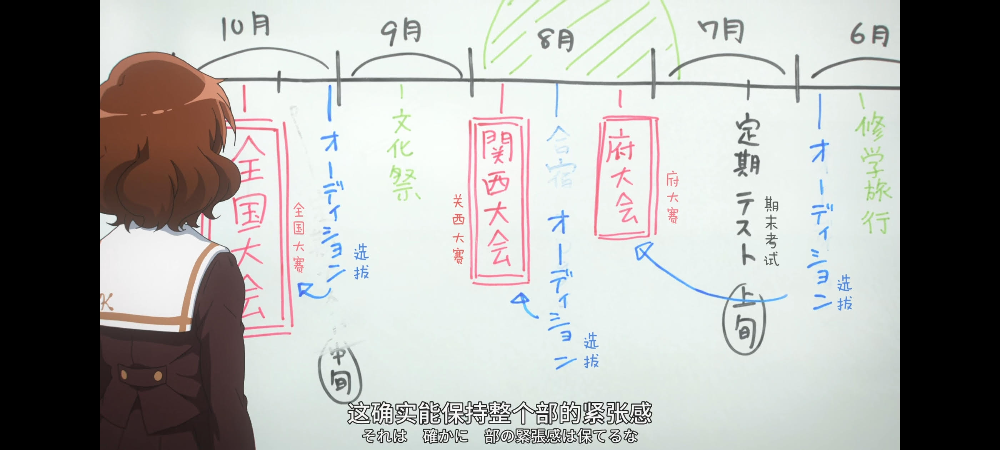
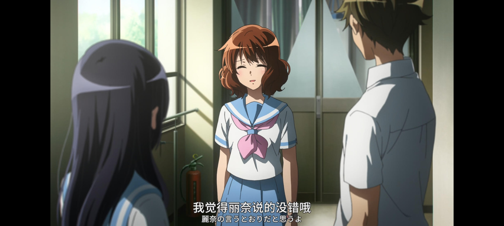

# 久〇年：黑暗中的迷茫与反抗——资历主义统治下的北宇治高中吹奏乐部

&emsp;&emsp;在整个久〇年，先后发生了以下主要事件：三年生集体摆烂——引起南中集团不满——引发一年生与三年生的矛盾——最终爆发“伞木希美之乱”——三年生毕业。

&emsp;&emsp;北宇治吹奏乐部在久〇年甚至以前，一直以“论资排辈”、“资历优先”的散漫主义进行着社团建设，以至于久〇年的三年生集体凭借着资历，让他们的散漫主义作风不仅对一二年生，甚至对于顾问（任职期到了最后一年的梨香子老师）都产生了潜移默化的影响。于是乎便出现了[*FoffeR*][link1]前辈所提到的符合[乔治・斯蒂格勒](https://baike.baidu.com/item/乔治·斯蒂格勒)所提出的“监管俘获”现象（即决策者或整个团体被拉拢服务于少数人，这将导致净损失）[^1]。而当下的北宇治吹奏乐部就无比符合这一现象的描述：三年生把控社团一切，从社团活动内容、管理方面，到大赛出场名额、声部独奏人选，甚至于顾问都被三年生牵着走。顾问被架空，三年生手握大权，整个社团都在服务于”混吃等死”的三年生，这就导致了净损失：京都府赛得到了等同于安慰奖的铜奖。但是即使这样三年生也无所谓，间接导致的结果就是：无论下层的学生如何协商，只要三年生死性不改，仍然保持一幅无所谓的样子，那便无懈可击，一切协商以及请求都如同空。另一方面，在更早的黄前十三年，南中在初中组府赛取得银奖，彼时不甘心的南中部长伞木希美对铠塚霙说到：等上了高中，一定要拿下金奖。等到久〇年（黄前十四年）南中一行人来到北宇治，他们却发现吹奏乐部内的氛围与她们所期待的积极向上完全不同，于是以伞木希美和若井堇为代表的南中一年生团体便开始了她们的斗争：与三年生进行和谈，希望他们改变。但结局可想而知：一年生的反抗以南中集团中的10人退部而告终，史称“伞木希美之乱”。此一事件基本宣告低年级的反抗失败。

&emsp;&emsp;那么，“伞木希美之乱”有什么积极影响吗？我认为，其不仅没有积极作用，反而还为三年生摸鱼提供了更舒服的环境。毕竟他们只会认为没有一年生那些小鬼头来捣乱，自己就能更便利地继续混。而且，一年生大量退部也同时宣告着南中集团在本年级的力量变得薄弱。再回头看二年生，中立的二年生在久〇年发挥了怎样的作用呢？首先，二年生虽然被”资历制度”摧残打压，但二年生也并没有帮助反抗的一年生，更多的是在息事宁人。比如明日香对希美说过的：“为什么要退部呢？只需要再等一年，三年生就退部了”就体现了二年生的不抵抗、不反抗策略。

&emsp;&emsp;总的来说，久〇年的事件发展可概括为：三年生掌握大权却无所作为，不求进取——引发南中集团众人内心“想要认真吹奏”的理想无法实现的不满——引发一年生与三年生的矛盾上升至冲突——在以资历主义为大环境的北高吹奏乐部，一年生的反抗效果微乎其微，最后无奈退部。

&emsp;&emsp;由此可见，**久〇年的北高吹奏乐部存在以下问题：顾问们（梨香子顾问，美知惠副顾问）被三年生俘获、失能，三年生实现对社团全面接管；以资历主义为纲，资历主义深入人心，导致社团管理层腐败现象严重；年级与年级之间没有交流，一年生与二年生毫无话语权。**如此垂直分层、密不透风的久〇年社团结构，为后续北宇治高中吹奏乐部社团建设留下了一个千疮百孔的地基。

# 久一年：历史的转折点——扁平化结构的转型阶段

&emsp;&emsp;北宇治高中吹奏乐部在久一年迎来了最大的变数——新顾问泷升。为什么说泷升是最大的变数？首先，在久〇年，处于任职期最后一年的梨香子老师并未把重心放在社团建设上，导致了这一年顾问被三年生牵着走。但是，久一年泷升来到北宇治，接替毫无主见的梨香子老师后，实施了一系列举措，让顾问的地位由原先的“随行者”转变为“决策者”：他收归权力，重新确立顾问及副顾问对吹奏乐部的管理地位（由泷升决断是否参加北宇治高中吹奏乐部一直以来参加的Sunfes一事）；他借用“羊群效应”使吹奏乐部绑定于“全国大赛出场”的目标上，从而凝聚吹奏乐部力量；他借由吉川优子引发的“小号soli”之争，引入实力至上主义，以抗衡资历散漫主义。另一方面，相比于久〇年的二年生的无所作为，在久一年，被调侃为“任务触发器”的一年生黄前久美子有着更加积极活跃的表现（“伞霙和解”、“明日香退部危机”），这严重破坏了久〇年以资历为准的“垂直体系”，使得吹奏乐部向“扁平化结构”跨越了至关重要的一步。同时，三香启用了“声部首席会议”，也让部员之间能够更好地进行交流。在整个久一年，泷升与三香利用优秀的选拔制度来决定出场名额，规范了部员的行为。但由于吹奏乐部还处在扁平化结构的探索阶段，所以许多机构还处在萌芽之中，并未设置。（如专门的新生指导机构）在久一年，对吹奏乐部具有重大贡献作用的便是泷升与三香的全面合作，使得它开始由资历主义制度过渡到实力主义制度。

&emsp;&emsp;久一年是腐败的北宇治高中吹奏乐部走向光明改革的第一年。**在这一年中，吹奏乐部注入了新鲜的血液：顾问替换，重新收归了中央大权；以三香为首的第一代领导集团登上了历史舞台；“北中三杰”来到了伟大的北宇治高中吹奏乐部。**吹奏乐部社团结构由原先的垂直分层摇身一变，变为扁平化结构，部员拥有了跨年级交流的权利。社团整体由资历主义向实力主义过渡，为久二年的建设奠定了一个良好的开头。总之，久一年是开启新篇章的关键一年。

# 久二年：新气象的延续——扁平化结构的发展新阶段

&emsp;&emsp;在久二年，以吉川优子为核心的南中第二代领导集体进入了北宇治吹奏乐部的政治核心。首先我们需要明确一个事实：久〇年时期发生的大型退部事件“南中之乱”所埋下的种子，其必然后果便是在久二年的A编成员中，三年生的占比不足50%。换言之，A编将会包括大量的一年生，势必导致整体吹奏水平下滑。为了提升一年生的吹奏水平，首先就要做好他们的思想工作，让一年生保持对社团的一致信任。作为吹奏乐部的实际代表，领导层必须扩大与各年级部员的接触面，加强对新生的指导频度，调节各部员内心产生的疑惑与矛盾，以“稳定新生”，为社团所用。所以优子部长设立年级指导（学年リーダー）和新生指导来加强吹奏乐部三个年级部员之间的沟通，进一步加强了社团的凝聚力，形成了久二年新结构“跨年级交流的扁平化结构”。倘若不进行革新，那么原来的扁平化结构中，各部员的交流仍是不到位的，领导层无法充分理解低年级部员的想法与意见，每一届的新生必然会与老生产生矛盾，最后演变为公开冲突。为了缓和一年生与社团的矛盾，年级指导与新生指导这两个职位便显得尤为重要。（久美子真的很会开窗呢！）

&emsp;&emsp;在止步关西赛后，三年生便黯然退出了社团。不过，为了保证社团内部不松懈，为久三年做充足的准备，保持良性竞争，优子部长颁布了最后一条指令：部员自行组队，参加小单位的合奏比赛，全体部员都要参与。这就是优子在位时期为北高贡献的最后一个锦囊——“确立小合奏比赛制度”，让吹奏乐部在技术上保持持续的竞争，避免出现摆烂、掉队等现象。

&emsp;&emsp;另一方面，久一年时期三香与指导泷升分权的传统也延续到了久二年的南中集团。优子在位期间，由于见识到了声部会议的众口难调，所以选择了废除声部会议制度，改为中央集权。在决策层面，一切皆以优子的意见为准则。然而，这样的做法弊端也很明显：久二年一共有89名部员，仅凭优子一人是无法统治如此庞大的吹奏乐部的。如果身边没有夏纪给优子及时拉闸，优子恐怕会像暴走火车头一样一直干下去，直到累到力不从心。操劳了如此之久的优子认为，如果把这样一个社团交给久美子，那么她也是会累塌的。对此，优子已经设计好了一套新制度：将“日常”与“技术”进行“分化事权”——增设“领队（Drum Major）”一职，与部长/副部长分权，部长/副部长仅负责管理日常事务，领队要避免被环境所干扰，一心钻研技术，一人全权负责训练事责，以期实现“削弱相权”，减轻部长负担。因此，优子选择了曾任新生指导的黄前久美子作为部长，冢本秀一作为副部长，高坂丽奈作为领队。然而，增设领队一职，有利，同时也有隐藏的弊。根据这套制度设计，训练事宜全权由丽奈一人决定，也就为“久三难题”埋下了一颗定时炸弹。

&emsp;&emsp;综上，**久二年时期，在三香与优子的接续带领下，吹奏乐部已经平稳步入了新阶段，社团基本结构、基本框架也已经确立。“南中维新”更是把部长的权力推到了一个顶峰。这也促使优子为后辈考虑，采取措施将部长的权力进行制衡，对扁平化结构做出了新的贡献。**在其他方面，优子则大体上延续了久一年的传统。久二年为久三年久美子能够顺利接管吹奏乐部做好了准备，同时也为久三年的蓝图建设打好了地基，是承上启下的关键一年。

# 久三年：新体制下的暗流涌动———扁平化结构的创新阶段与领导阶层的“虚假扁平化”

&emsp;&emsp;在久三年，光荣伟大的久美子来到了忠诚的北宇治高中吹奏乐部（“忠诚！！！”）。历经了前辈们两年的改革努力，两年的结构转型，北宇治高中吹奏乐部已经稳定为了一个扁平化的结构，而领导集团也迎来了再一次的革新：“三核心”领导集体。优子在与第三代领导集体交接时，增设了“领队”一职，主掌技术指导（“吉川中兴”）。表面上，这仅仅是与部长/副部长进行分权；但实际上在执行的过程中，由于泷升通常仅负责合奏时的指导和A编的选拔，并未参与到吹奏乐部的日常管理之中，没有完全发挥音乐顾问的职能（良好的沟通技巧和说服力，为自己的学生提供个性化服务与指导）——仅仅重视技术方面的提升，不注重社团内部的氛围，导致了又一场巨大的“监管滑坡”[^1]。

&emsp;&emsp;久三年的Sunfes训练，就是一起非常典型的体现泷升无所作为的事件。Sunfes训练中，从头到尾只有干部在管理社团，泷升几乎从未参与。于是，丽奈在此时便担任起了与泷升相同的角色。北宇治高中吹奏乐部在泷升接管之后，前两年都没能拿到全国金，在久二年甚至没能闯进全国赛。作为泷升头号粉丝的高坂丽奈，看到如此惨淡的战绩，势必要在泷升指导自己的最后一年里，为泷升、为北宇治拿下一块全国金奖。抱着这样的心态，丽奈开启了她的“斯巴达式训练”[^2]，也被戏称为“高压锅训练模式”。值得肯定的是，高坂丽奈作为领队的本职工作是做得非常出色的，很大程度上促进了部员们的基础实力提升，为当下的北宇治吹奏乐部奠定了实力基础。不过，面对这种训练产生的种种问题，久美子作为丽奈的挚友、同时也作为部长，基于对于丽奈的信任，为避免冲突，在很多时候都选择了沉默。久美子想的是如何解决产生的问题，而不是对于问题的根源——训练本身——加以修正。训练时间、严格程度和整体内容，这些全权仍然由丽奈一人决定。（从这一点也能看出这是久三年的一场裹挟全体社团意志——全国金奖——的巨大“监管俘获”。丽奈手掌训练大权，担任起“指导老师”的角色，使整个社团都服务于“泷升——丽奈”的技术团体）

&emsp;&emsp;另一方面，一年生还未接受北宇治吹奏乐部的“苦亚西”（悔しい）精神指导，更多时候想的是“如何快乐地吹奏”，缺少二、三年生的执念与追求——毕竟一年生对于“全国金奖”还并没有一个明确的概念。“反正自己还有很长的时间，所以哪怕这次失败了也没有关系。”——如果抱有这样的想法，在面临考验时，一年生就难以用严格的准则来约束自己，而是更倾向于给自己找后路。加上他们也没有前辈那么优秀的心理抗压能力，因此多半无法忍受丽奈的“高压锅式训练”。作为一年生领头羊的义井沙里，一边劝同学们不要轻易退部，一边思考对策，也成为了一年级生矛盾的聚焦点。于是，以义井沙里、釜屋雀为首，爆发了久三年的第一个矛盾———“久五逆流”。

&emsp;&emsp;好在开窗能力极强的久美子部长及时发现端倪，慰问了义井沙里一行人，给予了她们思想上的极大安慰与肯定，并承诺有任何问题都可以来找部长进行倾诉，“久五逆流”才告一段落。久三年第一起矛盾的爆发，就**体现了久三年体制运行的不合理之处：第三代领导集体三人之间缺乏恰当的沟通，即使考虑到有通过“干部笔记”进行一定程度的调整。**但是，这仅仅是表层的问题，因为作为部长和副部长的久美子与秀一在矛盾处理的层面上并没有任何沟通不畅，更深层次的问题源于作为领队的高坂丽奈。高坂丽奈在久三年的行事准则，与具有极强“社团性质”[^1]的社团背道而驰。**当然，这也是优子对久三年体制设计的弊端所在：优子所设计的“领队”一职，本来就应该不受社团内部氛围和复杂的人际关系干扰，一心抓技术，自行其事。丽奈权力过大、一意孤行、对于泷升的执念和久美子对她的妥协，这些都是优子所未能考虑到的。**设计上的缺陷在实践中未能得到改善，导致久三年的矛盾一个接一个地爆发。

&emsp;&emsp;紧接着“久五逆流”，另一个矛盾的根源初现端倪，那便是学习清良女高的制度——“三次选拔制度”（分别针对于京都府赛，关西大赛，全国大赛三个赛程进行的选拔）。在表面上看来，这一制度可以增加内部竞争，增强部员技术，与“吉川中兴”中“小合奏比赛制度”的理念上是一致的，有其优点。但是，未能全面考虑便引进的制度，势必会引起一场血雨腥风。

&emsp;&emsp;这个制度最大的不合理之处就在于其引进的时间点。**虽然“三次选拔制度”是一个好制度，但是不适合于当下的北宇治高中吹奏乐部，可谓“病急乱投医”。**当下的北宇治，三年生23人（含黑江真由），二年生43人，一年生仅仅25人（因为久二年止步关西成绩不够理想，所以远小于去年的43人），总计91人。面对需要55人组成的A编，北宇治人才储备不足的问题仍较为突出。举个简单的例子：如果你在A编的位置无可替代，在府赛和关西赛都担任solo，却在第三次选拔中被刷下去了，那么自己一定会备受打击。这样的心情体现在演奏中，就无法呈现完美的和声。显然，这个体制在当下的北宇治并不受用。

&emsp;&emsp;如同我们后来所知道的那样，第三代领导集体选择了冒险，尝试将“三次选拔制度”引进北宇治。受到这个不合时宜的制度影响，受害者出现了——黄前久美子。在府赛的时候，秋之章的soli是由久美子和丽奈共同负责的，同样也拿下金牌出线，皆大欢喜，没有任何矛盾；而在关西赛选拔时，一切都变了，soli之位被空降三年生——黑江真由夺走，久美子因此陷入了深深的自我怀疑的精神内耗之中，而由soli之位变动所引发的“黄泷党争”——一方面是以久石奏为代表的黄派，认为双方实力相当，soli之位应该让给对社团贡献更大的更辛劳的部长；另一方面则是以高坂丽奈为代表的泷派，认为部员应该毫无疑问地遵从顾问的安排——的矛盾无人调节（我也不知道此时此刻的秀一在做什么，可能是去干加部友惠的经理之类的各种各样的一些琐事吧）。黄派质疑顾问，泷派不满黄派，吹奏乐部部内人心散乱，社团严重停滞，劲不往一处使，吹奏实力的提升也无从谈起。**而这一切负面效果，都是久美子与黑江真由二者之间微弱的实力差距所无法补足的。**针对soli选拔引发的后续事态，泷升作为选择A编成员的掌权者，**自始至终没有从团结部内成员的角度出发，出面给予解释**（我也不知道能够解释出什么花来，我在我的另一篇文章：《[论〈一年之诗〉秋之章独奏之争，究竟谁更胜一筹？](/2024/08/30/The_Soloist/)》已经做出了合理且理性的分析了：久美子比黑江真由更适合吹独奏），**也不关注部内气氛所带来的对乐声的影响，这无疑不是一场“监管滑坡”**。泷升选择真由作为soli，不仅导致吹奏乐部人心不齐，而且导致久美子需要花费额外的时间来进行自我情绪调节；花费更多的时间精力练习吹奏，以在下一次、也是高中的最后一次选拔中夺回soli之位。这样一来，部长与部员之间的沟通势必减少，扁平化结构被间接削弱，引起了另一种“监管滑坡”。

&emsp;&emsp;“人心不齐，音色不济”对吹奏乐部的影响是极大的。久三年的这次事件与久〇年的“南中之乱”大同小异，同样都是两党之争，但好在这次的事态最终稳定了下来。久美子在关西赛前，携带着慷慨激昂的《努力宣言》回归，稳定了军心，北宇治在关西赛也顺利出线。虽然在当前的局面看来，这也算是一种较好的结局，但是我们换位思考一下：假设选择的是久美子，真由也不会因此而难过（源于她在清良的背景，自己对于拿不拿金奖不关心，更加关注的是能不能跟大家一起快乐地吹奏），而社团也会是一种欣欣向荣的风气。社团内部多会出现“不愧是黄前部长，努力果然没有白费呢！”诸如此类的评价。这样的评价也更会产生积极影响：“只要努力了，就会有你想要看到的结果。”激励部员更加努力奋进。这种良好的氛围将进一步巩固久美子的地位。由此看来，选择久美子才是不二之选。

&emsp;&emsp;泷升在此处的抉择，并没有权衡利弊，仅仅维持自己内心“公平竞选”的考虑。这不仅仅是泷升对于社团内部的不关心，也是不关心学生个体意愿的体现。（黑江真由曾多次表露自己“想要退出选拔”的心理，但是久美子仅仅认为这是她害怕自己作为一个外人影响了原本社团内部氛围的借口，所以拒绝了她的请求。而泷升更加无从得知黑江真由的心理了。）倘若领导层多与基层群众多进行沟通，例行举办一次“班会”，事情可能就不会沦落到如此地步。

&emsp;&emsp;**这一事件的发生，是全体领导层的失能**：久美子作为部长，陷入自我内耗，不能及时把控社团情况；秀一作为副部长，未能及时接管部长职能，对部员的行为加以干预，没有及时安抚部长的心情，使其更快恢复振作；丽奈作为领队，未能与两位部长多加以沟通，了解基层部员的真实情况；泷升未能与基层部员多进行沟通，以疏导内心的矛盾。

&emsp;&emsp;整个久三年，一开始增设领队一职，由于沟通不当，导致领队与一年生爆发了第一次冲突；而引进新制度则为第二次冲突埋下了祸根，泷升未能权衡利弊，看清当下局势，引发了这场潜在的危机；第二次矛盾爆发之后，领导层便大面积失能：部长失格、副部长划水、顾问失能；最后，还是靠久美子的自我意识觉醒，才将北宇治高中吹奏乐部从水火之中拯救了出来。**这么多矛盾都离不开的一个关键点便是“领导层”，久三年的主要矛盾爆发点就是领导集团内部的沟通不够彻底，可称之为第三代领导集团内部的“虚假扁平化”。而其揭示的根本问题，则是北宇治没有制约领导层的机构。**因为没有设置针对于领导层的管理机构与领导层互相制衡、在领导层拉闸之后迅速进行干预，导致一旦有事，事态就快速扩大。在久三年，领导层处理事态的方式与前辈们一模一样：都是将事态压下去（缓和矛盾），而并没有将事件摆在明面上处理。所以我认为，北宇治高中吹奏乐部在久三年后的几次革新，都将围绕“领导层——三年生”来展开。

&emsp;&emsp;在久三年伊始，北宇治在前两代领导集体的努力下，已经缓缓驶入了历史正轨。以“北中三杰”为核心的第三代领导集体，继承前辈的事业，实现了前人未有之创举。当然，这也是第一次采用“三核心”为领导集体的一年，虽然最终取得了令人满意的结果（~~但又好像不太满意~~），拿到了全国金奖，但是也经历了万分艰难、曲折的探索过程，在各种问题的处理上略有瑕疵。总结这一探索过程中解决各种问题的经验教训，其中最重要的便是北宇治缺乏制约领导层的专门机构。领导层一旦罢工，整个社团都面临轰然倒塌的风险。**这样一来，久三年便为久四年指明了前进方向：针对领导层，建立一个全新的制度体系。**这一思路，也是久三年为“将北宇治建设为吹奏乐部强校”所作出的重要贡献。

# 致谢

&emsp;&emsp;感谢[FoffeR][link1]大佬对于我此篇文章的帮助！

# 参考文献
[^1]: [FoffeR][link1].《[狂澜如何不倾，大厦如何不倒？北宇治问鼎全国的奥秘为何？（上）](/2024/04/25/kuanglanbuqing1/)》
[^2]: 古意：指一种起源于古希腊斯巴达的训练，是一种结合军事、体能和纪律的全面训练；指强调严格的军事训练和体能训练，以适应战场上的需求。今意：指通过高强度的训练方法和大量的训练时间，加强部员们的基本功与基础实力，以在大赛上对抗其他吹奏乐强校。
[^3]: 社团性质是指社团的基本属性和特征，主要包括自主管理，非营利性等特点。社团通常是由公民所自愿组成，按照其章程开展活动，不以营利为目的，是为了实现共同意愿为目标。[^1]
[link1]: https://space.bilibili.com/20255489
